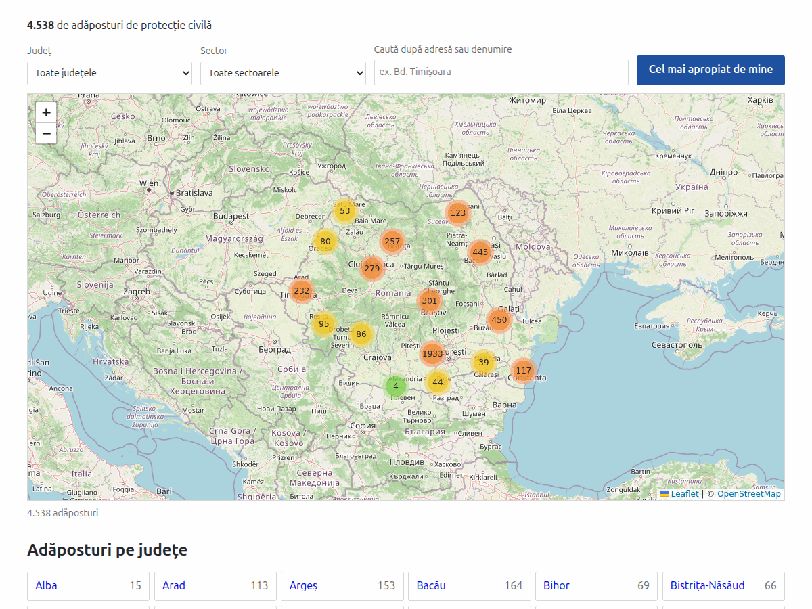
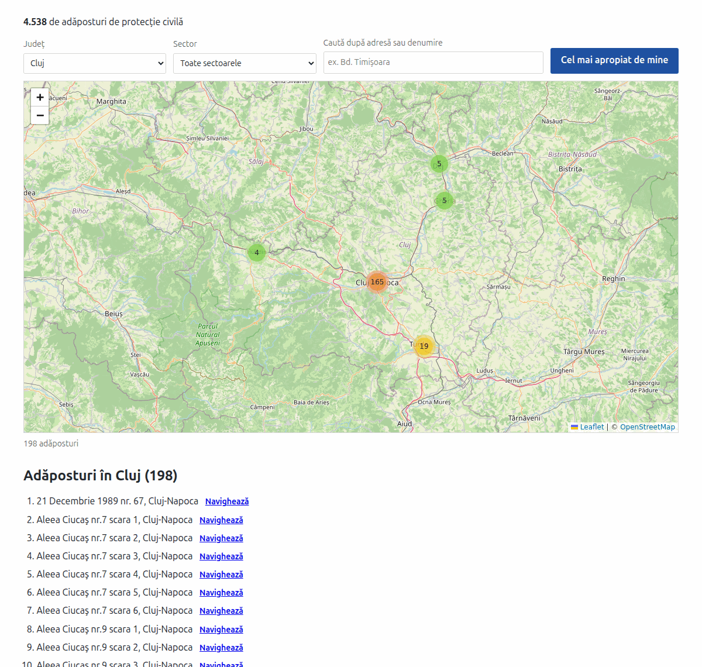

# Shelter Map

A WordPress plugin that puts the **4,538 civil protection shelters of Romania** on a
clustered Leaflet map — with county and sector filtering, diacritic-insensitive search and
a nearest-shelter lookup.

No map API key. No billing account. No database tables, no queries, no cookies, no
settings page.



## Why

It was written to replace *WP Google Maps* on a site that had the shelter registers in it.
The old setup pulled in 14 JavaScript files (650 KB uncompressed) plus the Google Maps
JavaScript API, and fetched the markers over a REST round trip. This ships ~130 KB
gzipped in total, all static and cacheable, and the map only loads once it nears the
viewport.

## Install

Download `shelter-map-ve.zip` from the [latest release](../../releases/latest) and upload
it under **Plugins → Add New → Upload Plugin**, or drop the folder into
`wp-content/plugins/`.

Then put the shortcode in a page:

```
[smve_map]
```

Attributes, all optional:

| Attribute | Default | Meaning |
|---|---|---|
| `height` | `600` | map height in pixels (300–1200) |
| `zoom` | `6` | initial zoom level |
| `lat`, `lng` | `44.109417`, `24.359083` | initial centre |

`zoom`, `lat` and `lng` set the view shown before the shelters arrive; once they have, the
map frames whatever is currently displayed.

## What it does

* **Clusters** every shelter, so several thousand markers stay usable on a phone.
* **Filters** by county, and by sector inside Bucharest.
* **Searches** shelter names and addresses without caring about diacritics — `timisoara`
  finds `Timișoara`.
* **Finds the nearest shelter** to the visitor, across the whole set rather than the
  current filter, and shows the distance.
* Gives every shelter a **directions link** that opens the visitor's own maps app.
* Renders the county navigation and, at `?county=<slug>`, that county's full list **on the
  server** — so both work without JavaScript and are indexable.



## How the data is built

Each shelter carries only a name, an address and coordinates. The county is **not** parsed
out of the address — matching on text gets it right about 42% of the time and trips over
street names — it is computed offline by point-in-polygon against Romanian county
boundaries and shipped inside the data files. Nothing is computed at runtime.

The pipeline lives in [`build/`](build/README.md) and is deterministic: re-running it on
unchanged input reproduces byte-identical output.

```sh
sh      build/fetch-boundaries.sh     # county polygons, ~32 MB, not committed
python3 build/build-data.py           # source-data/markers-raw.tsv -> data/*.json
python3 build/make-mo.py              # languages/*.po and *.mo
php     tests/render-test.php         # 27 assertions, no WordPress needed
python3 build/make-zip.py             # dist/shelter-map-ve.zip
```

### Data quality

The source registers are not error-free. Thirteen records name a Bucharest sector in their
own address but sit outside Bucharest on the map, and the corruption is systematic — the
integer part of the latitude or longitude is one too high (`45.44229,27.13429` where
`44.44226,26.13433` was meant). Twelve were re-geocoded against OpenStreetMap and verified
on street, sector and house number; one could not be found and kept its original
coordinates.

That rule only catches the Bucharest cases. A full audit of all 4,538 geocodes has **not**
been done, and it is likely that other counties carry similar errors. Corrections are
welcome through the issue tracker.

## Requirements

WordPress 5.8+, PHP 7.4+. No Composer, no npm, no build step for the plugin's own code.

## Licence

MIT — see [LICENSE](LICENSE), which also covers the bundled Leaflet and
Leaflet.markercluster and credits the boundary data.
